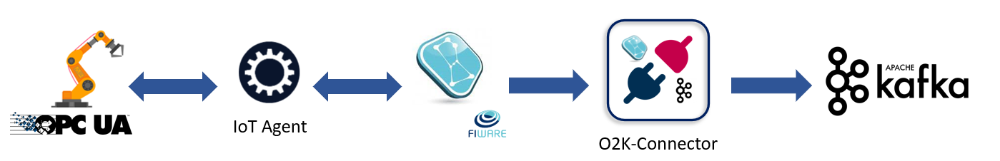

# O2K-Connector: a FIWARE Orion to Kafka Connector

[](https://www.fiware.org/developers/catalogue/)
[](https://opensource.org/licenses/AGPL-3.0)
[](https://stackoverflow.com/questions/tagged/fiware+o2k)<br/>

<br/>
 

O2K-Connector is a lightweight connector, built in Python, that enables context data sharing from Orion Context Broker towards Apache Kafka. In more detail, O2K-Connector subscribes to Orion Context Broker and publishes the received context-data to a built-in kafka topic.

<br/>
<br/>

## O2K-Connector example placement in a FIWARE/Apache Architecture

# 

## Contents

-   [Install](#install)
  -   [Configuration](#configuration)
  -   [Docker Install](#docker---recommended)
-   [API](#api)
-   [Testing](#testing)
-   [License](#license)

## Configuration

O2K-Connector can be fully customized and configured by the means of environment variables listed on __*o2k.env*__ file.

<table role="table">
    <thead>
        <tr align="center">
            <th>Environment variables</th>
            <th>Description</th>
        </tr>
    </thead>
    <tbody>
      <tr>
          <td>LOG_LEVEL</td>
          <td>Level of O2K Debug. Possible values: INFO, DEBUG, ERROR</td>
      </tr>
      <tr>
          <td>LOGS_PATH</td>
          <td>Path of O2K-Connector logs</td>
      </tr>
      <tr>
          <td>O2K_HOST</td>
          <td>Listener for O2K-Connector</td>
      </tr>
      <tr>
          <td>O2K_PORT</td>
          <td>Port of O2K-Connector</td>
      </tr>
      <tr>
          <td>SCHEMA_URL</td>
          <td>Kafka Schema url for avro messages</td>
      </tr>
      <tr>
          <td>BOOTSTRAP_SERVERS</td>
          <td>Kafka Boostrap Servers</td>
      </tr>
      <tr>
          <td>KAFKA_TOPIC</td>
          <td>User-specified Kafka Topic, if left blank, it will be auto-generated on the fly taking into account FIWARE_SERVICE and FIWARE_SERVICEPATH environments for NGSI V2 and entity id for NGSI-LD</td>
      </tr>
      <tr>
          <td>ORION_HOST</td>
          <td>Hostname of Orion Context Broker</td>
      </tr>
      <tr>
          <td>ORION_PORT</td>
          <td>Port of Orion Context Broker</td>
      </tr>
      <tr>
          <td>FIWARE_SERVICE</td>
          <td>Fiware Service for NGSI V2</td>
      </tr>
      <tr>
          <td>FIWARE_SERVICEPATH</td>
          <td>Fiware ServicePath for NGSI V2s</td>
      </tr>
      <tr>
          <td>MQTT_HOST</td>
          <td>Hostname of MQTT Server, if used</td>
      </tr>
      <tr>
          <td>MQTT_PORT</td>
          <td>Port of MQTT Server, if used</td>
      </tr>
      <tr>
          <td>MQTT_TOPIC</td>
          <td>Topic to which publish on MQTT Server, if used</td>
      </tr>
      <tr>
          <td>SUBSCRIPTION_JSON_PATH</td>
          <td>Path of subscription configuration files</td>
      </tr>
      <tr>
          <td>SUBSCRIPTION_JSON_FILENAME</td>
          <td>Filename of subscription configuration file for NGSI V2 subscription</td>
      </tr>
      <tr>
          <td>SUBSCRIPTION_JSON_FILENAME_LD</td>
          <td>Filename of subscription configuration file for NGSI-LD subscription</td>
      </tr>
      <tr>
          <td>SUBSCRIPTION_JSON_FILENAME_MQTT</td>
          <td>Filename of subscription configuration file for NGSI-V2 subscription and MQTT underlying subscription engine</td>
      </tr>
      <tr>
          <td>SUBSCRIPTION_SCHEMA_FILE_PATH</td>
          <td>Filename of subscription schema file for NGSI V2 subscription</td>
      </tr>
      <tr>
          <td>SUBSCRIPTION_SCHEMA_FILE_PATH_LD</td>
          <td>Filename of subscription schema file for NGSI-LD subscription</td>
      </tr>
      <tr>
          <td>SUBSCRIPTION_SCHEMA_FILE_PATH_MQTT</td>
          <td>Filename of subscription schema file for NGSI-V2 subscription and MQTT underlying subscription engine</td>
      </tr>
      <tr>
          <td>ORION_VERSION</td>
          <td>Orion Context Broker version. Possible values: V2, LD</td>
      </tr>
      <tr>
          <td>ORION_SUBSCRIPTION</td>
          <td>Orion Context Broker subscription engine. Possible values: http, mqtt</td>
      </tr>
      <tr>
          <td>MULTIPLE_SUBSCRIPTIONS</td>
          <td>For NGSI V2 only: set to "false" to handle a unique subscription with multiple attributes</td>
      </tr>
      <tr>
          <td>KAFKA_ENABLE_SSL</td>
          <td>Set to "true" if want to use SSL connection to Kafka</td>
      </tr>
      <tr>
          <td>KAFKA_SSL_CA</td>
          <td>Certificate Authority key (path file inside the container) to use for SSL connection to Kafka</td>
      </tr>
      <tr>
          <td>KAFKA_SSL_KEY</td>
          <td>Client key (path file inside the container) to use for SSL connection to Kafka</td>
      </tr>
      <tr>
          <td>KAFKA_SSL_CERTIFICATE</td>
          <td>Certificate key (path file inside the container) to use for SSL connection to Kafka</td>
      </tr>
  </tbody>
</table>

## Getting Started - Install

To instantiate O2K-Connector you can use docker-compose which will take care of the creation of the container running python. Alternatively you can locally run the connector by running the python script.

N.B:
The connector will create a Kafka Topic structured as follows:
<code>{FIWARE_SERVICE}\_{FIWARE_SERVICEPATH*}\_{NGSI_ENTITY_ID}\_{NGSI_ENTITY_TYPE}</code>

*FIWARE_SERVICEPATH is deprived of '/' character

### Docker - Recommended

1. Configure subscription payload configuration _'subscription.json_' inside "conf" folder.
2. Configure your environment variables in the _'docker-compose.yml'_ file
3. Run docker-compose command into project root folder:
```sh
docker-compose up
```

## API

<table role="table">
    <thead>
        <tr align="center">
            <th>HTTP Method</th>
            <th>Service</th>
            <th>Description</th>
        </tr>
    </thead>
    <tbody>
      <tr>
          <td>POST</td>
          <td>/notify</td>
          <td>V2 Context data ingestion route</td>
      </tr>
        <tr>
          <td>POST</td>
          <td>/notifyld?subscriptionId=urn:ngsi-ld:Type:Entity</td>
          <td>LD Context data ingestion route</td>
      </tr>
  </tbody>
</table>


## Testing

To test O2K-Connector, few services are required, in particular:
 - Orion Context Broker
 - A fully working Kafka Environment

At startup O2K-Connector subscribes to Orion Context Broker which is required to be running. Context-data will start being published to a given Kafka Topic (generate on-the-fly) as soon as possible.

To text context-data consumpion, run kafka-console-consumer command:

<code>kafka-console-consumer --bootstrap-server broker-1:29092,broker-2:29093,broker-3:29094 --topic {FIWARE_SERVICE}\_{FIWARE_SERVICEPATH*}\_{NGSI_ENTITY_ID}\_{NGSI_ENTITY_TYPE}</code>

*FIWARE_SERVICEPATH is deprived of '/' character

## License
O2K-Connector is licensed under

*GNU Affero General Public License v3.0*
