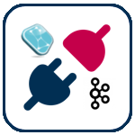

#  O2K-Connector
O2K-Connector is a lightweight connector, built in Python, that enables context data sharing from Orion Context Broker towards Apache Kafka. In more detail, O2K-Connector subscribes to Orion Context Broker and publishes the received context-data to a built-in kafka topic.

## O2K-Connector example placement in a FIWARE/Apache Architecture

# 

## Contents

-   [Install](#install)
    -   [Docker install](#docker---recommended)
-   [API](#api)
-   [Testing](#testing)
-   [License](#license)

## Getting Started - install

To instantiate O2K-Connector you can use docker-compose which will take care of the creation of the container running python. Alternatively you can locally run the connector by running the python script.

N.B:
The connector will create a Kafka Topic structured as follows:
<code>{FIWARE_SERVICE}\_{FIWARE_SERVICEPATH*}\_{NGSI_ENTITY_ID}\_{NGSI_ENTITY_TYPE}</code>

*FIWARE_SERVICEPATH is deprived of '/' character

### Docker - Recommended

1. Configure subscription payload configuration _'subscription.json_' inside "conf" folder.
2. Configure your environment variables in the _'docker-compose.yml'_ file
3. Run docker-compose command into project root folder:
```sh
docker-compose up
```

## API

<table role="table">
    <thead>
        <tr align="center">
            <th>HTTP Method</th>
            <th>Service</th>
            <th>Description</th>
        </tr>
    </thead>
    <tbody>
      <tr>
          <td>POST</td>
          <td>/notify</td>
          <td>V2 Context data ingestion route</td>
      </tr>
        <tr>
          <td>POST</td>
          <td>/notifyld?subscriptionId=urn:ngsi-ld:Type:Entity</td>
          <td>LD Context data ingestion route</td>
      </tr>
  </tbody>
</table>


## Testing

To test O2K-Connector, few services are required, in particular:
 - Orion Context Broker
 - A fully working Kafka Environment

At startup O2K-Connector subscribes to Orion Context Broker which is required to be running. Context-data will start being published to a given Kafka Topic (generate on-the-fly) as soon as possible.

To text context-data consumpion, run kafka-console-consumer command:

<code>kafka-console-consumer --bootstrap-server broker-1:29092,broker-2:29093,broker-3:29094 --topic {FIWARE_SERVICE}\_{FIWARE_SERVICEPATH*}\_{NGSI_ENTITY_ID}\_{NGSI_ENTITY_TYPE}</code>

*FIWARE_SERVICEPATH is deprived of '/' character

## License
O2K-Connector is licensed under

*GNU Affero General Public License v3.0*

